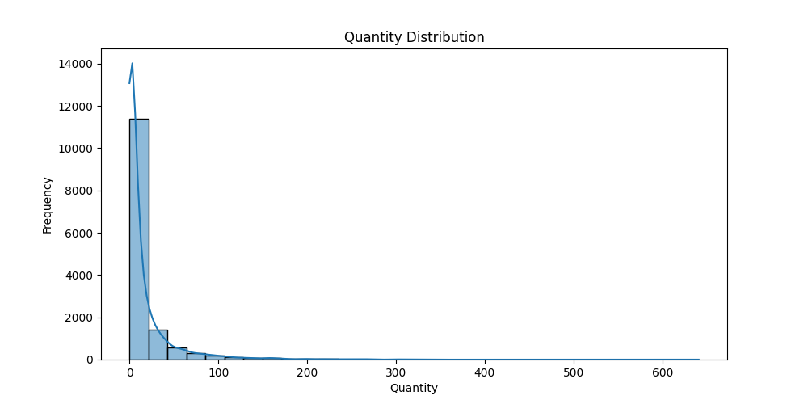
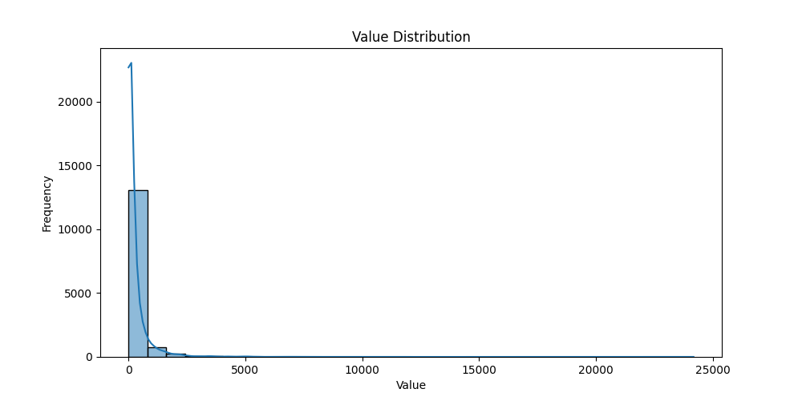
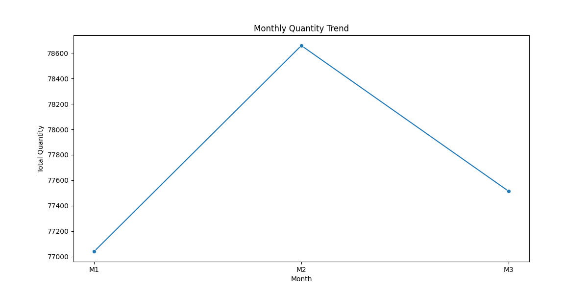
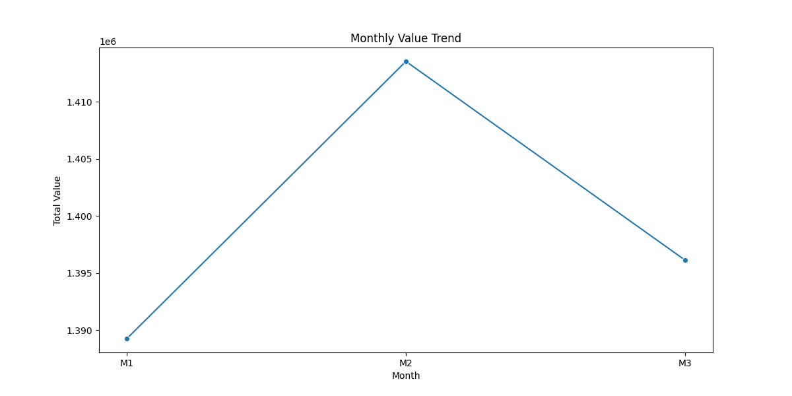
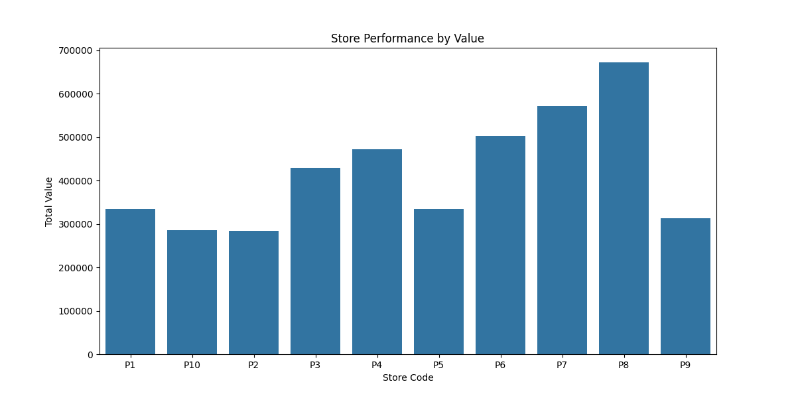
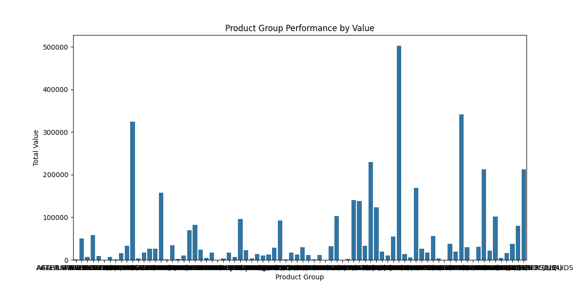
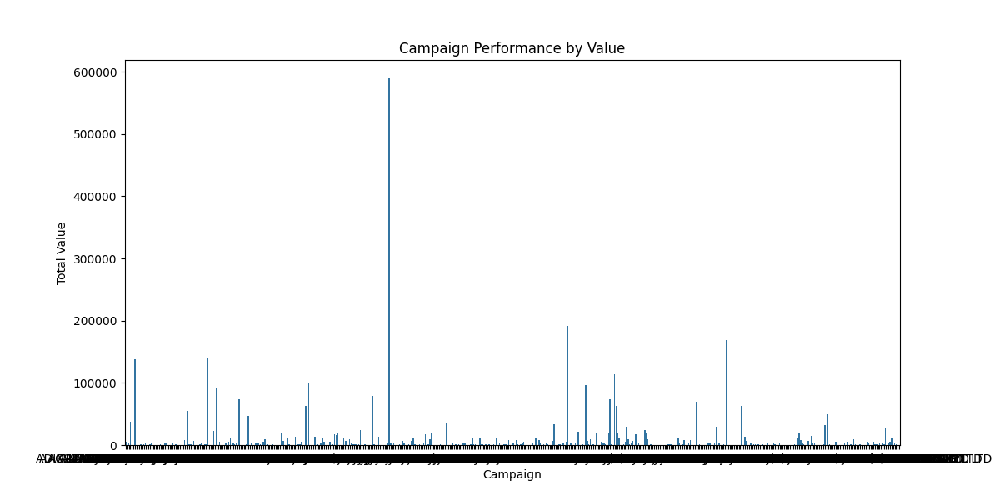

# Customer Behavior Analysis on Transaction Data

## 🎯 Project Objective

The goal of this project is to perform a detailed Exploratory Data Analysis (EDA) to understand and analyze customer behavior based on transaction data. The insights gained will help inform business strategies and support decision-making.

## 🗂️ Data Description

The dataset used in this project is available [here](data\Store_Transaction_Data.csv). It contains the following features:

- **MONTH**: The month in which the transaction occurred.
- **STORECODE**: The unique code representing the store where the transaction took place.
- **QTY**: The quantity of items purchased in the transaction.
- **VALUE**: The monetary value of the transaction.
- **GRP**: The general category of the product purchased.
- **SGRP**: The sub-category of the product.
- **SSGRP**: The sub-sub-category of the product.
- **CMP**: The campaign or promotion associated with the transaction.
- **MBRD**: The membership ID of the customer making the transaction.
- **BRD**: The brand of the product purchased.

## Distribution and Trend Analysis

### 1. Quantity Distribution

- **Explanation**: This graph shows the distribution of the quantity of items purchased in transactions. It helps in understanding the overall buying behavior of customers, such as whether they tend to purchase in bulk or in smaller quantities.

### 2. Value Distribution

- **Explanation**: This graph depicts the distribution of transaction values. It provides insights into the financial aspect of customer behavior, indicating whether transactions are generally of low, medium, or high value.

### 3. Monthly Quantity Trend

- **Explanation**: This time series plot shows the trend in the quantity of items purchased each month. It helps identify seasonal patterns and fluctuations in customer demand over time.

### 4. Monthly Value Trend

- **Explanation**: This graph represents the monthly trend in transaction values. It is crucial for understanding how the monetary aspect of customer behavior changes over time, which can be influenced by factors such as promotions or seasonal sales.

## Store, Product, and Campaign Performance

### 5. Store Performance by Value

- **Explanation**: This bar chart compares the performance of different stores based on the total value of transactions. It highlights which stores are the top performers and which may need strategic improvements.

### 6. Product Group Performance by Value

- **Explanation**: This chart shows the total transaction value for different product groups. It identifies which categories are most popular among customers and generate the most revenue.

### 7. Campaign Performance by Value

- **Explanation**: This graph evaluates the effectiveness of different promotional campaigns by comparing the total transaction value associated with each campaign. It helps in understanding which campaigns were most successful in driving sales.

## 📝 Project Structure

### 1.0 Data Preparation

- **1.1 Importing Modules and Dataset**: Import necessary Python libraries and load the dataset.
- **1.2 Data Cleaning**: Handle missing values, remove duplicates, and ensure appropriate data types.
- **1.3 Data Transformation**: Create new features such as the total transaction value.

### 2.0 Data Exploration and Visualization

- **2.1 Distribution Analysis**: Analyze the distribution of transaction quantities and values.
- **2.2 Time Series Analysis**: Explore trends and patterns in the data over time.

### 3.0 Store, Product, and Campaign Analysis

- **3.1 Store Analysis**: Evaluate the performance of different stores.
- **3.2 Product Analysis**: Analyze the performance of various product categories.
- **3.3 Campaign Analysis**: Assess the effectiveness of promotional campaigns.

### 4.0 Summarize Key Findings and Derive Actionable Insights

- **4.1 Summary of Key Findings**: Summarize the key findings from the analysis.
- **4.2 Deriving Actionable Insights**: Provide actionable insights based on the analysis.

### 5.0 Recommendations

- **5.1 Providing Recommendations Based on Insights**: Offer recommendations to improve business performance, including inventory management, marketing, campaign strategies, customer retention, and brand promotion.

## 🚀 Expected Outcomes

By completing this project, the business will gain insights into:

- Customer preferences for different products and brands.
- The impact of promotional campaigns on sales.
- Seasonal trends and monthly sales patterns.
- Performance metrics for different stores.
- Detailed segmentation of customers based on their purchasing habits.

These insights will enable data-driven decision-making to optimize marketing strategies, improve inventory management, enhance customer retention efforts, and drive business growth.

## 📄 Project Files

- `Customer_Behavior_Analysis.ipynb`: Jupyter notebook containing the complete analysis.
- `README.md`: This file, providing an overview of the project.

## 🛠️ Requirements

- Python 3.x
- Pandas
- Matplotlib
- Seaborn
